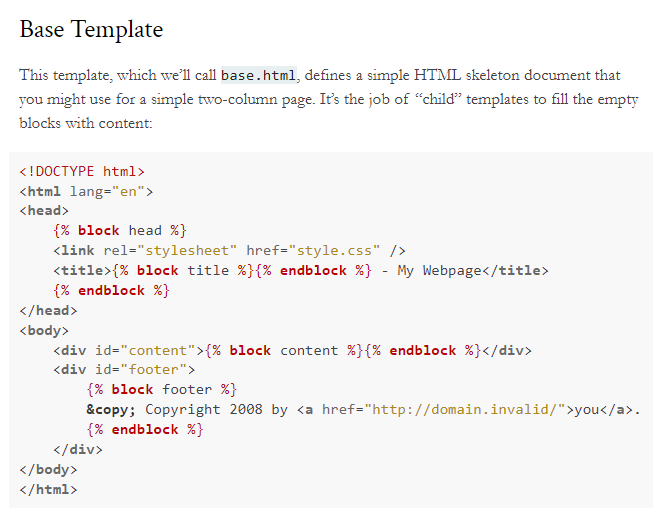

### Bootstrap 整合 Flask
- 跟flask一點關係都沒有，是一個快速做網頁的東西，可以整合html、css做網頁
- responsive web dedign：針對不同硬體的網頁設計
- 專業的網頁設計師，還是透過html跟css設計，而bootstrap是比較快速方便的方式，他有預設非常多css的模板，不僅如此，連javascripts模板也有
- 作法：
    1. [去Bootstrap網頁](https://bootstrap5.hexschool.com/docs/5.1/getting-started/download/) *台灣六角學院做的中文版*
    2. 下載完成後，在檔案夾內新增static資料夾，裡面放如css、js資料夾
    3. 把最基本的css跟js檔案放入相對應資料夾(基本檔案+map檔，js一定要搭配map檔才能運作)
    4. 建立templates資料夾，放入index.jinja.html資料夾，因為裡面是用jinja語法，所以建議html檔名裡面要有jinja
    5. 在html裡面連結css與javascropts：
        - 語法不要用背的，要學會在哪裡查語法
        - 在flask裡面查語法
        - 用url_for連結css、js(注意js必須要在body裡面用scripts連結)
    6. 回到py設定render

### 嘗試透過bootstrap設定導覽列
- 去六角學院找適合的導覽列&代碼
- 複製到body裡，並注意對應縮排，用div class="constainer"包起來，代表響應式網頁
- 記得js的設定要對，放在div外面&body裡
- 可以用```<!--->```寫導覽列註解
- 可以調整中文文字的設定
- 到網頁的「開發者人員工具」點選「切換裝置工具列」可以調整各裝置手機平板的模擬畫面
- 不要改bootstrap的css，要的話就在html裡面用style包起來改

### 做不同的分頁(feature頁面)
- 在templates放上新的html頁面
- 到py檔裡面用app註冊新的頁面名稱，並回傳到render templates
```
@app.route("/feature")
def feature():
    return render_template('feature.jinja.html')
```

- 把index的語法複製到feature頁面，修改document叫做特色
- 在兩個html頁面裡面的超連結，用Jinja的語法放入連結設定
```
 <a class="nav-link active" aria-current="page" href="{{url_for('index')}}">首頁</a>
<a class="nav-link" href="{{url_for('feature')}}">特色</a>
```

## Jinja
### Template Inheritance樣板繼承
- 可以寫一個base.html基本頁面，用繼承的方式簡化步驟
- 父類別的內容無條件讓子繼承，且一個父可以給很多給子繼承

### 父parent

其中的

### 子child